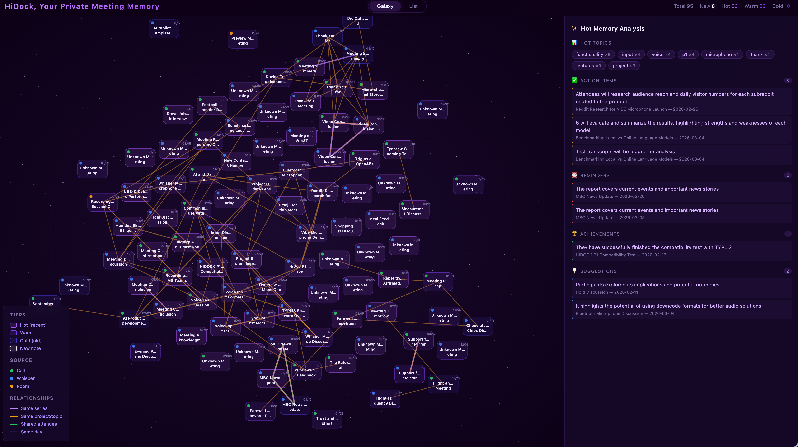

# HiDockSkill

**100% local** meeting transcription, summarization, and visualization for [HiDock](https://www.hidock.com/) USB meeting recorders. No cloud. No API keys. No subscriptions.

> Your meetings stay on your machine. Always.

> [!WARNING]
> **Close any HiNotes web tabs before using HiDockSkill.**
>
> HiNotes Web (and any other browser tab using the WebUSB API to talk to your
> HiDock) takes **exclusive control** of the device. While a HiNotes tab is
> open in Chrome/Edge/Brave, HiDockSkill cannot claim the USB interface and
> the watcher's auto-sync silently fails with `LIBUSB_ERROR_ACCESS`.
>
> **Symptom:** plug in your HiDock, no auto-sync runs, the dashboard's device
> file list stays empty, and `usb-watch.log` shows repeated
> `[file-poll] skipped: claimInterface error: Error: LIBUSB_ERROR_ACCESS`.
>
> **Fix:** close every browser tab on `hidock.com` / HiNotes Web, then unplug
> and replug your HiDock (or wait ~15s for the next file-poll cycle).

## How It Works

```
 HiDock H1E/P1          Moonshine             Ollama             Galaxy Dashboard
 ┌──────────┐      ┌──────────────┐     ┌──────────────┐     ┌──────────────────┐
 │  USB      │─────>│  Local ASR   │────>│  Local LLM   │────>│  D3.js force     │
 │  Record   │      │  + Speaker   │     │  Summary +   │     │  graph of all    │
 │           │      │  Diarization │     │  Action Items │     │  your meetings   │
 └──────────┘      └──────────────┘     └──────────────┘     └──────────────────┘
     .hda files       Transcription        Structured MD         Interactive UI
```

1. **Plug in** your HiDock H1E or P1 via USB — auto-detected
2. **Transcribe** with [Moonshine](https://github.com/usefulmachines/moonshine) — local speech-to-text with speaker diarization
3. **Summarize** with [Ollama](https://ollama.com/) — local LLM extracts title, attendees, topics, action items
4. **Resolve speakers** — heuristic + LLM-based name detection with hallucination filtering
5. **Save** structured Markdown notes with audio files to tiered storage (hot/warm/cold)
6. **Visualize** in the Galaxy Dashboard — an interactive constellation of your meeting history

## Galaxy Dashboard

A D3.js force-directed graph that maps all your meeting notes as an interactive constellation.



- **Galaxy view** — force-directed graph with memcard nodes, orbital rings by tier (hot/warm/cold), color-coded source type dots, and relationship edges
- **List view** — searchable, sortable table of all notes
- **Tab switcher** — floating tabs at top center to switch between views
- **Note popup** — click any card or row to open a modal with summary, transcript, and audio player with click-to-seek sync
- **AI insights sidebar** — hot topics cloud, action items, reminders, achievements extracted from recent notes
- **Syncing overlay** — pulsing animation while device is syncing, auto-transitions to galaxy when ready

Open the dashboard:

```bash
npm run galaxy:open
```

Or visit http://127.0.0.1:18180 when the USB watcher is running.

## Quick Start

### 1. Prerequisites

- **Node.js** 20+
- **ffmpeg** — audio format conversion
- **Python 3** with [moonshine_voice](https://github.com/usefulmachines/moonshine) — local transcription
- **Ollama** with a model pulled (default: `qwen3.5:9b`)

```bash
# Install Ollama and pull the default model
curl -fsSL https://ollama.com/install.sh | sh
ollama pull qwen3.5:9b
```

### 2. Install

```bash
git clone https://github.com/build-hidock/HiDockSkill.git
cd HiDockSkill
npm install
```

### 3. Connect HiDock via USB

> **USB exclusivity:** HiDock can only be owned by one app at a time. Close HiNotes web/browser before using HiDockSkill.

### 4. Sync recordings

```bash
npm run meetings:sync
```

### 5. Start USB watcher (recommended)

Auto-syncs when you plug in, opens galaxy dashboard, sends macOS notifications:

```bash
npm run usb:watch
```

## AI Agent Integration

HiDockSkill works as a skill for **OpenClaw** and **Claude Code**:

```bash
# OpenClaw
ln -s /path/to/HiDockSkill ~/.openclaw/skills/hidock-skill

# Claude Code
git clone https://github.com/build-hidock/HiDockSkill-Claude ~/.claude/skills/hidock-skill
```

Then just say **"HiDock"** to open the galaxy dashboard, or **"sync HiDock"** to sync recordings. The USB watcher forwards notifications to Slack via OpenClaw CLI.

## CLI Commands

| Command | Description |
|---------|-------------|
| `npm run meetings:sync` | Sync all new recordings from device |
| `npm run usb:watch` | Long-running USB plug-in monitor with auto-sync |
| `npm run galaxy:open` | Open galaxy dashboard in browser |
| `npm run galaxy` | Start galaxy server without opening browser |
| `npm test` | Run test suite |
| `npm run build` | Compile TypeScript |

## Sync Flags

```bash
npm run meetings:sync -- [flags]
```

| Flag | Description |
|------|-------------|
| `--dry-run` | List files without processing |
| `--limit N` | Process only newest N files |
| `--whisper-only` | Only whisper memo recordings |
| `--meetings-only` | Only meeting recordings |
| `--language CODE` | Language hint (e.g., `en`, `zh`) |
| `--storage <dir>` | Override storage directory |
| `--state-file <path>` | Override sync state file |

## USB Watcher Flags

```bash
npm run usb:watch -- [flags]
```

| Flag | Description |
|------|-------------|
| `--interval-ms N` | Poll interval (default: 5000) |
| `--no-auto-sync` | Watch-only, no sync on plug-in |
| `--no-emit-on-startup` | Skip notification if already connected |
| `--sync-debounce-ms N` | Debounce window (default: 1500) |
| `--no-slack-forward` | Disable Slack forwarding |
| `--slack-target ID` | Slack DM target for notifications |

## Storage Layout

Notes are organized by age into tiered storage:

```
<storage>/
  meetingindex.md              # Master meeting index
  whisperindex.md              # Master whisper memo index
  meetings/
    hotmem/YYYYMM/            # 0-30 days
    warmmem/YYYYMM/           # 31-180 days
    coldmem/YYYYMM/           # 181+ days
  whispers/
    hotmem/                    # Recent memos
    warmmem/                   # Older memos
    coldmem/                   # Archived memos
```

Each note is a Markdown file with YAML front matter, summary, and transcript sections. Audio files (`.mp3` or `.wav`) are saved alongside each note for in-browser playback via the Galaxy Dashboard.

## Environment Variables

| Variable | Description | Default |
|----------|-------------|---------|
| `MEETING_STORAGE_DIR` | Notes storage root | (compiled-in) |
| `OLLAMA_HOST` | Ollama server URL | `http://localhost:11434` |
| `OLLAMA_MODEL` | LLM model for summarization | `qwen3.5:9b` |
| `WHISPER_LANGUAGE` | Language hint for Moonshine | (auto-detect) |
| `HIDOCK_NOTES_BACKEND` | `local` or `memdock` | `local` |
| `HIDOCK_NOTES_TIER_HOT_MAX_DAYS` | Hot tier max age | `30` |
| `HIDOCK_NOTES_TIER_WARM_MAX_DAYS` | Warm tier max age | `180` |

## Source Types

HiDock filenames encode the recording type (e.g., `2026Feb21-132825-Rec00.hda`):

| Type | Pattern | Color |
|------|---------|-------|
| Room | `Room` | $\color{orange}{\textsf{Orange}}$ |
| Call | `Call` | $\color{green}{\textsf{Green}}$ |
| Whisper | `Whsp` | $\color{royalblue}{\textsf{Blue}}$ |

## Get HiDock

HiDockSkill requires a [HiDock](https://www.hidock.com/) USB meeting recorder. The **HiDock H1E** is an 8-in-1 USB-C docking station with built-in AI voice recorder — meeting notes, 4K display, 65W charging, gigabit ethernet, all in one device.

**Free transcription. Forever.**

[Get HiDock H1E](https://openclaw.hidock.com) | [Learn more](https://www.hidock.com/)

## Troubleshooting

### `LIBUSB_ERROR_ACCESS`
Another app holds the USB device. Close HiNotes web/browser, kill stale processes:
```bash
pkill -f "usb:watch"
pkill -f "meetings:sync"
```

### Ollama connection refused
Make sure Ollama is running:
```bash
ollama serve
```

### Device not found
Ensure HiDock is connected via USB. On macOS, check System Information > USB.

## Contributing

See [CONTRIBUTING.md](CONTRIBUTING.md) for guidelines on bug reports, feature requests, and pull requests.

## License

MIT — see [LICENSE](LICENSE)
